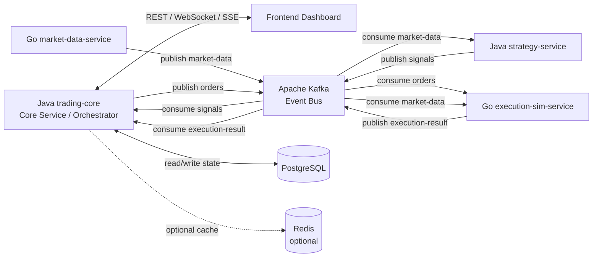

<p align="center">
  
</p>

<h1 align="center">Porta</h1>

<p align="center">
  Porta is a distributed trading-system MVP with a dashboard, Java backend services, Go data services, Kafka event streaming, and PostgreSQL-backed portfolio state.
</p>

<p align="center">
  The documentation-facing project name is <strong>Porta</strong>.
</p>

<a align="center" href="http://194.87.54.82">
  http://194.87.54.82
</a>

---
<h2 align="center">Team</h2>

<div align="center">

<table>
  <tr>
    <th>Development</th>
  </tr>

  <tr>
    <td>
      <table>
        <tr>
          <td><b>Ernest</b><br>Java Backend</td>
          <td><b>Nikita</b><br>Golang Backend</td>
          <td><b>Zakhar</b><br>Golang Backend</td>
        </tr>
      </table>
    </td>
  </tr>

  <tr>
    <td>
      <table>
        <tr>
          <td><b>Islam</b><br>Frontend / Design</td>
          <td><b>Amina</b><br>DevOps / Infrastructure</td>
        </tr>
      </table>
    </td>
  </tr>
</table>

<br>

<table>
  <tr>
    <th colspan="3">Other</th>
  </tr>
  <tr>
    <td><b>Anya</b><br>Presentation</td>
    <td><b>Katya</b><br>Presentation</td>
    <td><b>Masha</b><br>Q&amp;A engineer</td>
  </tr>
</table>

</div>

---

<h2 align="center">Architecture Overview</h2>

Porta uses Java `trading-core` as the central core service, orchestrator, and backend-for-frontend.

The frontend boundary is strict:

```text
Frontend -> Java trading-core -> Kafka / PostgreSQL / backend services
```

The frontend must not communicate directly with non-BFF backend services, Kafka, or PostgreSQL:

```text
Frontend -> strategy-service / Go services
Frontend -> Kafka
Frontend -> PostgreSQL
```

Kafka is the main event bus between backend services. Java `strategy-service` consumes market data and publishes trading signals. Java `trading-core` consumes trading signals, creates orders, publishes orders, consumes execution results, updates order and portfolio state, persists state in PostgreSQL, and exposes frontend-facing APIs.



---

<h2 align="center">Technology Stack</h2>

| Area | Technology |
| --- | --- |
| Frontend | React, TypeScript, Vite |
| Core backend | Java, Spring Boot, Spring Kafka, Spring Data JPA |
| Strategy backend | Java, Spring Boot, Spring Kafka |
| Data services | Go services for market data and execution simulation |
| Event streaming | Apache Kafka |
| Persistent storage | PostgreSQL |
| Optional cache | Redis |
| Local infrastructure | Docker / Docker Compose |
| Observability | Structured logs |

---

<h2 align="center">Service Responsibilities</h2>

| Service | Responsibility |
| --- | --- |
| Frontend Dashboard | Displays market data, signals, orders, executions, service status, and portfolio state. It communicates only with Java `trading-core`. |
| Java `trading-core` | Central core service and backend-for-frontend. It exposes REST APIs, consumes signals, creates orders, publishes orders, consumes execution results, updates portfolio state, and persists state. |
| Java `strategy-service` | Consumes market data and publishes MVP trading signals to Kafka topic `signals`. |
| Go `market-data-service` | Publishes market data events to Kafka topic `market-data`. |
| Go `execution-sim-service` | Consumes `orders` and `market-data`, keeps latest prices in a local MVP cache, simulates fills, and publishes `execution-result` events. |
| PostgreSQL | Stores orders, executions, signals, positions, portfolio snapshots, and market data history where needed. |

---

<h2 align="center">Kafka Topics</h2>

| Topic | Producer | Consumers | Purpose |
| --- | --- | --- | --- |
| `market-data` | `market-data-service` | Java `strategy-service`, `execution-sim-service`, optionally `trading-core` | Market price events. |
| `signals` | Java `strategy-service` | `trading-core` | Trading decisions that become orders. |
| `orders` | `trading-core` | `execution-sim-service` | Orders to execute or reject. |
| `execution-result` | `execution-sim-service` | `trading-core` | Execution outcomes used to update orders and portfolio state. |

Java `strategy-service` and `execution-sim-service` must use different Kafka consumer groups for `market-data` so both services receive the full stream.

---

<h2 align="center">Storage</h2>

PostgreSQL is the source of persistent state for the Java core service:

- orders;
- execution results;
- signals;
- market data history, when needed for dashboard and history views;
- positions;
- portfolio state and PnL.

Redis is optional and can be introduced for caching or shared low-latency reads. For the MVP, `execution-sim-service` can keep latest market prices in an in-memory cache.

---

<h2 align="center">Observability and Infrastructure</h2>

- Docker / Docker Compose are intended for local multi-service development.
- Structured logs should make the event flow traceable from market data to portfolio update.

---

<h2 align="center">How to Install and Use</h2>

This repository does not use `build:` entries in `docker-compose.yml`, so the application images must exist locally or be available in a remote registry before the system can be started with Docker Compose.

<h3 align="center">Prerequisites</h3>

- Docker Engine 24+;
- Docker Compose v2;
- optional for local frontend-only development: Node.js 20+ and npm;
- optional for running services outside Docker: Java 17+, Maven, and Go 1.26+.

<h3 align="center">Run the Full System Locally with Docker</h3>

1. Build the application images from the repository root:

```bash
docker build -t porta-trading-core:latest ./backend/java/trading-core
docker build -t porta-strategy-service:latest ./backend/java/strategy-service
docker build -t porta-market-data:latest ./backend/golang/market-data-service
docker build -t porta-execution-sim:latest ./backend/golang/execution-sim-service
docker build -t porta-frontend:latest ./frontend
```

2. Start the full stack:

```bash
docker compose up -d
```

3. Open the application:

```text
Frontend: http://localhost
Core API:  http://localhost:8080/api/v1
Health:    http://localhost:8080/api/v1/health
```

4. Stop the system when finished:

```bash
docker compose down
```

If you need to reset PostgreSQL state as well, remove volumes:

```bash
docker compose down -v
```

<h3 align="center">Frontend-Only Local Development</h3>

If backend services are already running and you only need the dashboard in development mode:

```bash
cd frontend
npm install
npm run dev
```

The frontend expects Java `trading-core` to be available at `http://localhost:8080/api/v1` unless `VITE_API_BASE_URL` is overridden.

<h3 align="center">Expected Runtime Flow</h3>

After startup, the normal MVP flow is:

```text
market-data-service -> Kafka -> strategy-service -> trading-core -> execution-sim-service -> trading-core -> frontend
```

`market-data-service` replays CSV market data continuously, so the dashboard should begin showing market data, signals, orders, executions, and portfolio updates shortly after all containers become healthy.

---

<h2 align="center">Detailed Documentation</h2>

More detailed documentation is available in the [`docs/`](./docs) directory:

- [Architecture](./docs/architecture.md)
- [Backend Flow](./docs/backend-flow.md)
- [Frontend API](./docs/frontend-api.md)
- [Kafka Topics](./docs/kafka-topics.md)
- [Event Contracts](./docs/event-contracts.md)
- [Demo Flow](./docs/demo-flow.md)
- [Development Notes](./docs/development-notes.md)

---

<h2 align="center">Demo Flow</h2>

1. Start infrastructure and backend services.
2. Start market data replay from `market-data-service`.
3. Market data is published to Kafka topic `market-data`.
4. Java `strategy-service` emits a signal to topic `signals`.
5. Java `trading-core` consumes the signal, creates an order, saves it, and publishes it to topic `orders`.
6. `execution-sim-service` consumes the order and latest market data, simulates execution, and publishes an `execution-result`.
7. Java `trading-core` updates order status and portfolio state in PostgreSQL.
8. The frontend dashboard reads the updated state from Java `trading-core`.

---

<h2 align="center">MVP Status</h2>

Porta is an MVP-oriented trading-system project. The current target is a clear end-to-end flow:

```text
MarketData -> Signal -> Order -> ExecutionResult -> PortfolioUpdate
```
