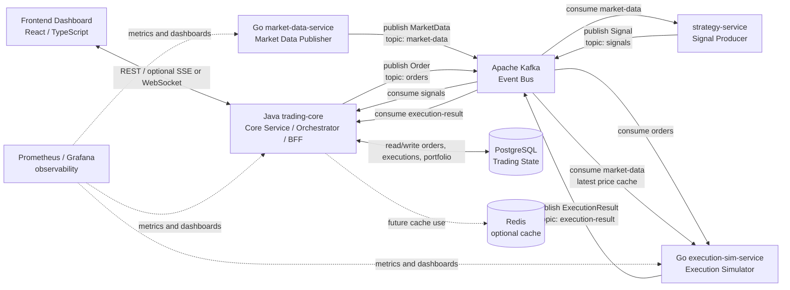

<h1 align="center">Architecture Documentation</h1>

## Purpose

Porta is a distributed trading-system MVP. Its purpose is to show a complete trading workflow from market data ingestion to portfolio state updates in a frontend dashboard.

The system is organized around a strict backend boundary:

```text
Frontend -> Java trading-core -> Kafka / PostgreSQL / backend services
```

The frontend must only communicate with Java `trading-core`.

The frontend must not:

- call Go services directly;
- consume Kafka directly;
- query PostgreSQL directly.

## High-Level Components

| Component | Role |
| --- | --- |
| Frontend Dashboard | Displays system status, market data, signals, orders, executions, positions, and portfolio summary. |
| Java `trading-core` | Core service, orchestrator, and backend-for-frontend. It owns frontend APIs and persistent trading state. |
| Kafka | Event bus between backend services. |
| Go `market-data-service` | Publishes market data events to Kafka. |
| `strategy-service` | Consumes market data and publishes trading signals. Current assumption: this service owns signal generation. |
| Go `execution-sim-service` | Simulates order execution using orders and latest market prices. |
| PostgreSQL | Persistent storage for trading state. |
| Redis | Optional cache for future shared low-latency data. |
| Prometheus / Grafana | Observability stack for metrics and dashboards. |

## Java trading-core as Orchestrator

Java `trading-core` is the central backend entry point for the frontend. It is responsible for:

- REST API for frontend;
- optional real-time APIs through SSE or WebSocket;
- consuming `signals`;
- creating and saving orders;
- publishing orders to Kafka;
- consuming `execution-result`;
- updating order status;
- updating portfolio state;
- reading and writing PostgreSQL state;
- returning stable dashboard snapshots.

## Kafka as Event Bus

Kafka decouples backend services. Services do not need to call each other directly for the main trading flow. Instead, they publish and consume events:

```text
market-data -> signals -> orders -> execution-result
```

`market-data` is consumed by both `strategy-service` and `execution-sim-service`. These services must use different consumer groups so both receive all market data events.

## PostgreSQL as Persistent State

PostgreSQL stores state owned by `trading-core`:

- signals received by Java;
- orders created by Java;
- execution results consumed by Java;
- positions;
- portfolio state;
- market data history if required by dashboard or history views.

## Optional Redis

Redis is optional. Possible future uses:

- latest price cache shared across services;
- dashboard snapshot cache;
- service heartbeat cache.

For MVP, `execution-sim-service` can keep latest prices in a local in-memory cache.

## Observability

The intended observability stack includes:

- Prometheus for metrics collection;
- Grafana for dashboards;
- structured logs for tracing events through the system.

Useful events to trace:

- market data publication;
- signal creation;
- order creation;
- order publication;
- execution result publication;
- portfolio update.

## Architecture Diagram


