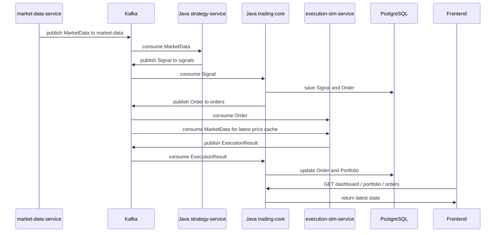

<h1 align="center">Backend Flow</h1>

The Porta backend flow is:

```text
MarketData -> Signal -> Order -> ExecutionResult -> PortfolioUpdate
```

The frontend reads the resulting state from Java `trading-core`. It does not talk to Java `strategy-service`, Go services, Kafka, or PostgreSQL directly.

## Step-by-Step Flow

1. `market-data-service` publishes market data.

   The Go `market-data-service` reads a CSV file, mock source, or external source and publishes events to Kafka topic `market-data`.

2. Java `strategy-service` consumes market data and emits signals.

   Java `strategy-service` reads topic `market-data`, applies simple MVP strategy logic, and publishes trading signals to topic `signals`.

3. Java `trading-core` consumes signals.

   `trading-core` listens to topic `signals` and treats each signal as a request to create an order.

4. Java `trading-core` creates orders.

   For MVP, orders can be treated as `MARKET` orders. Java assigns an order id, links the order to the signal, sets initial status, and stores the order.

5. Java `trading-core` publishes orders.

   Created orders are published to Kafka topic `orders`.

6. `execution-sim-service` consumes orders.

   The Go execution simulator listens to topic `orders`.

7. `execution-sim-service` also consumes market data.

   The simulator also listens to topic `market-data`.

8. `execution-sim-service` uses latest price cache.

   For MVP, the latest price cache can be in memory inside `execution-sim-service`. The simulator uses the latest known price for the order symbol.

9. `execution-sim-service` publishes execution result.

   If a current price is available, the simulator publishes a `FILLED` result. If no price is available or the price is stale, it can publish `REJECTED` or `NO_MARKET_DATA`.

10. Java `trading-core` consumes execution result.

    Java listens to Kafka topic `execution-result`.

11. Java `trading-core` updates order status and portfolio.

    On `FILLED`, Java updates:

    - order status;
    - cash;
    - open positions;
    - average entry price;
    - realized PnL;
    - unrealized PnL;
    - total portfolio value.

12. Frontend reads updated state from Java `trading-core`.

    The dashboard calls Java REST endpoints such as `/api/v1/dashboard`, `/api/v1/orders`, `/api/v1/executions`, and `/api/v1/portfolio`.

## Flow Diagram



## MVP Notes

- Latest price cache can be local and in memory in `execution-sim-service`.
- The frontend can use polling against `/api/v1/dashboard` every 1-2 seconds for MVP.
- SSE or WebSocket can be added later without changing the frontend/backend boundary.
